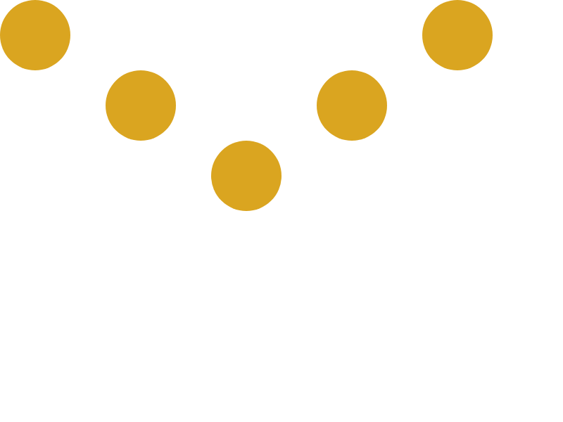

# Flexbox

Установите зависимости:

```
npm install
```

В файле `src/App.css` опишите стили для вёрстки из файла `src/index.html`

1. Файл `src/index.html` редактировать нельзя
2. Контейнер должен быть шириной `700px` и высотой `300px`
3. Элементы - круги `100х100px` (почитайте про свойство border-radius).
4. Цвет элементов - `#DAA520`
5. Первый и пятый элементы должны быть прижаты к верхнему краю оси Y
6. Второй и четвертый должны располагаться посередине по оси Y
7. Третий должен находится внизу по оси Y
8. Сами элементы должны располагаться по всей оси Х контейнера с одинаковыми промежутками между ними

Итоговый вариант будет выглядеть вот так: 

Проверить себя можно запустив команду `npm run test -- --watchAll`.

После выполнения задания создайте pull request с решением.
